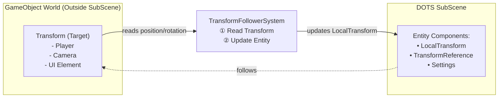
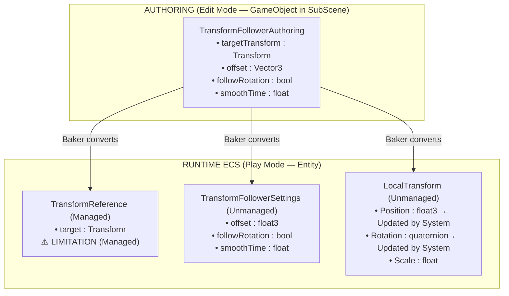
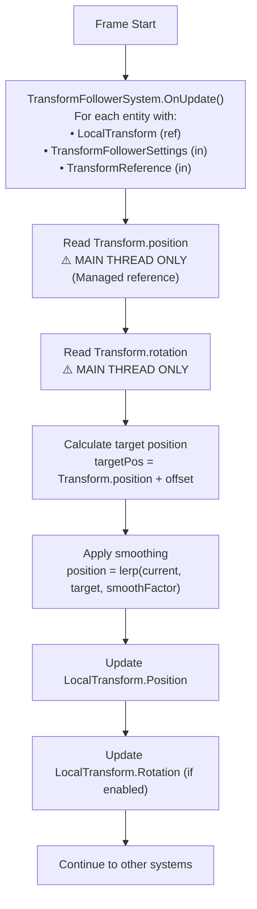
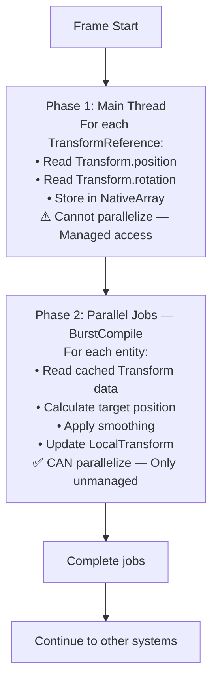
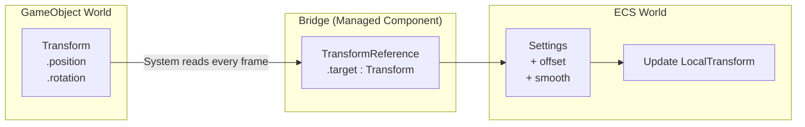
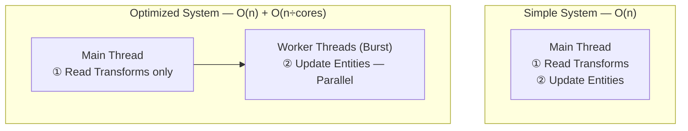
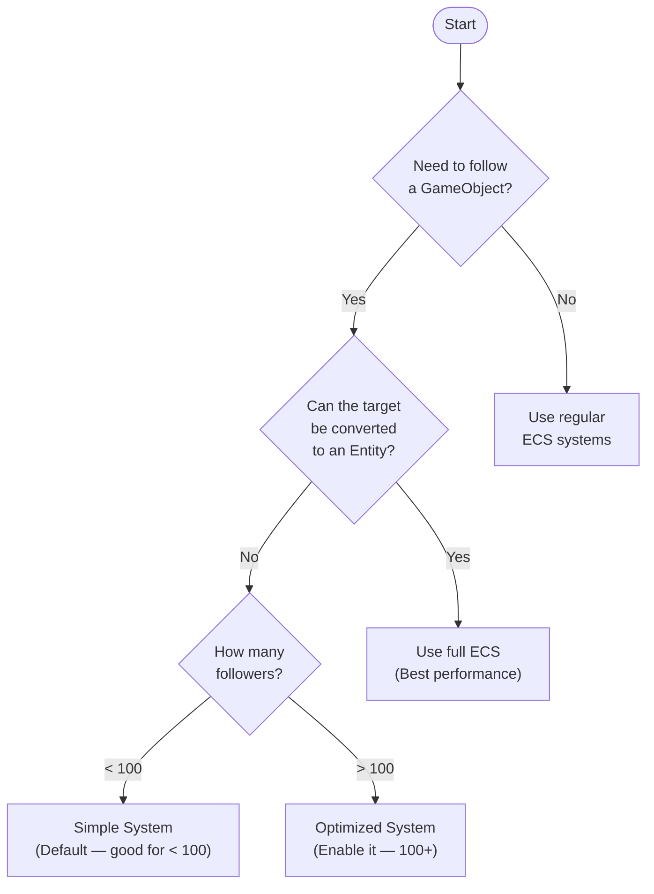

# TransformFollower — Architecture Diagrams

> **Scope:** This document covers the TransformFollower subsystem only.  
> For the Ace of Ages scene-wide architecture, see **[SCENE_OVERVIEW.md](SCENE_OVERVIEW.md)**.


## System Overview



## Component Relationships



## Update Flow (Simple System)



## Update Flow (Optimized System)



## Data Flow



## The Fundamental Limitation

The `TransformReference` managed component is required because Burst/Jobs **cannot** access GameObjects:

```csharp
// ❌ CANNOT DO (Burst/Jobs):
[BurstCompile]
void Update(Transform target)
{
    float3 pos = target.position; // ERROR — Managed reference
}

// ✅ CAN DO (Main Thread):
void Update(TransformReference transformRef)
{
    if (transformRef.target != null)
        float3 pos = transformRef.target.position; // OK
}

// ✅ WORKAROUND (Optimized):
// Step 1: Main thread — cache managed reads
NativeArray<float3> positions;
foreach (var t in transforms)
    positions.Add(t.position);

// Step 2: Burst job — process unmanaged data only
[BurstCompile]
void UpdateJob(NativeArray<float3> positions) { /* ... */ }
```

## Performance Comparison



## Use Case Decision Tree



---

This visual guide complements the documentation files.
