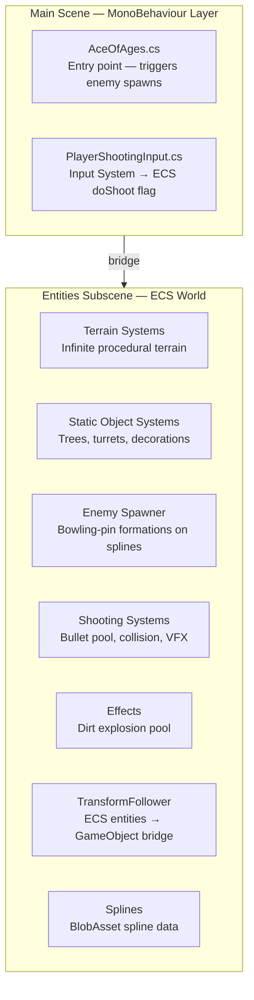
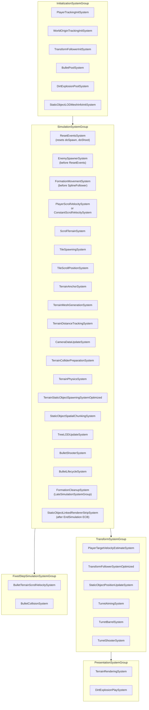

# Ace of Ages — Scene Overview

Top-level architecture guide for the Ace of Ages scene.

**Complete document listing:** [Table of Contents](TABLE_OF_CONTENTS.md)

---

## Architecture Summary

Ace of Ages is a Unity 6 VR application using a hybrid ECS + MonoBehaviour architecture:

- **ECS (DOTS):** All performance-critical runtime systems live in `Entities Subscene.unity` and run via Unity.Entities
- **MonoBehaviour:** VR input (`PlayerShootingInput`), scene entry point (`AceOfAges.cs`)
- **Bridge:** `TransformFollowerSystem` and `PlayerTrackingInitSystem` connect the MonoBehaviour player rig to ECS entities



---

## System Execution Order



---

## Key Singletons (ECS)

| Singleton | Description | Entity source |
| ----------------------------------- | ----------------------------------------------- | ------------------------------------------ |
| `TerrainTileConfig` | All terrain config parameters | `TerrainConfigAuthoring` |
| `ScrollOffset` | Accumulated terrain scroll offset | `TerrainConfigAuthoring` |
| `TerrainScrollVelocity` | Current scroll direction + speed | `TerrainConfigAuthoring` |
| `PlayerTransformReference` | Managed: player GO Transform | `TerrainConfigAuthoring` |
| `PlayerTargetVelocity` | Smoothed player horizontal velocity | `TerrainConfigAuthoring` |
| `CameraDataSingleton` | Camera position + forward for collider priority | `CameraDataUpdateSystem` (runtime) |
| `StaticObjectSpawnerConfig` | Static object spawn density/filters | `StaticObjectSpawnerConfigAuthoring` |
| `StaticObjectLODConfig` | LOD distances and VR frame-skip config | `StaticObjectSpawnerConfigAuthoring` |
| `PlayerTerrainScrollVelocityConfig` | Player scroll speed/rotation settings | `PlayerScrollVelocityAuthoring` |
| `WorldOriginTransformReference` | Managed: world origin GO Transform | `PlayerScrollVelocityAuthoring` |
| `PrefabEntitiesReferences` | Enemy, bullet, dirt explosion prefab entities | `PrefabEntitiesReferencesAuthoring` |
| `BulletPoolConfig` | Pool size config | `BulletPoolConfigAuthoring` |
| `DirtExplosionConfig` | Pool size + lifetime config | `DirtExplosionPoolConfigAuthoring` |

---

## Entry Point: `AceOfAges.cs`

The `AceOfAges` MonoBehaviour on the main scene camera triggers a test enemy spawn after 3 seconds:

```csharp
IEnumerator TestFunc()
{
    yield return new WaitForSeconds(3f);
    DoTestSpawn(); // Sets EnemySpawner.doSpawn = true via EntityQuery
}
```

For production use, replace this with gameplay-driven spawn triggers.

---

**See also:**

- [Table of Contents](TABLE_OF_CONTENTS.md) — complete document index for all subsystems
- `AGENTS.md` (workspace root) — complete project conventions and architecture guide
- `Terrain/Documentation/README.md` — terrain system documentation hub
