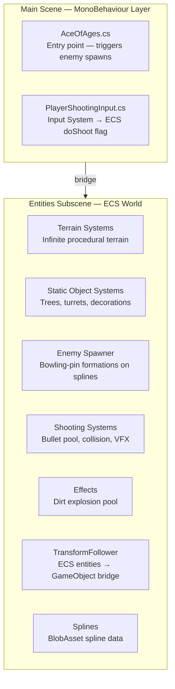
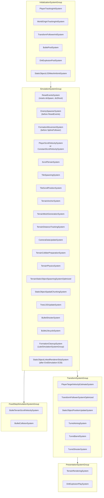

# Ace of Ages — Scene Overview

Top-level index for all subsystem documentation in the Ace of Ages scene.

**Complete document listing:** [Table of Contents](TABLE_OF_CONTENTS.md)

---

## Architecture Summary

Ace of Ages is a Unity 6 VR application using a hybrid ECS + MonoBehaviour architecture:

- **ECS (DOTS):** All performance-critical runtime systems live in `Entities Subscene.unity` and run via Unity.Entities
- **MonoBehaviour:** VR input (`PlayerShootingInput`), scene entry point (`AceOfAges.cs`)
- **Bridge:** `TransformFollowerSystem` and `PlayerTrackingInitSystem` connect the MonoBehaviour player rig to ECS entities




---

## Subsystem Documentation Index

### Terrain System

The largest subsystem. Infinite procedural terrain with mesh generation, physics colliders, static object spawning, and auto-scrolling.


| Document            | Location                                       | Description                                |
| ------------------- | ---------------------------------------------- | ------------------------------------------ |
| Quick Reference     | `Terrain/README.md`                            | Features, performance targets, quick start |
| Documentation Hub   | `Terrain/Documentation/README.md`              | Entry point for all terrain docs           |
| Table of Contents   | `Terrain/Documentation/TABLE_OF_CONTENTS.md`   | Complete terrain doc index                 |
| System Overview     | `Terrain/Documentation/SYSTEM_OVERVIEW.md`     | Architecture and data flow                 |
| System Reference    | `Terrain/Documentation/SYSTEM_REFERENCE.md`    | All 20+ ECS systems                        |
| Component Reference | `Terrain/Documentation/COMPONENT_REFERENCE.md` | All ECS components                         |
| API Reference       | `Terrain/Documentation/API_REFERENCE.md`       | Code examples                              |
| Configuration       | `Terrain/Documentation/CONFIGURATION.md`       | TerrainConfigAuthoring fields              |
| Quick Start         | `Terrain/Documentation/QUICK_START.md`         | 10-minute setup                            |


### Terrain Features


| Feature                                 | Document                                           |
| --------------------------------------- | -------------------------------------------------- |
| Static Object Spawning (trees, turrets) | `Terrain/STATIC_OBJECT_SPAWNING_SYSTEM.md`         |
| Static Object Rendering (LOD, BRG)      | `Terrain/Documentation/STATIC_OBJECT_RENDERING.md` |
| Terrain Anchor System                   | `Terrain/Documentation/TERRAIN_ANCHOR_SYSTEM.md`   |
| Physics Collider System                 | `Terrain/Documentation/PHYSICS_SYSTEM.md`          |
| Rendering System                        | `Terrain/Documentation/RENDERING_SYSTEM.md`        |
| Auto-Scrolling                          | `Terrain/Documentation/AUTO_SCROLLING.md`          |
| Player Tracking                         | `Terrain/Documentation/PLAYER_TRACKING.md`         |
| Debug Tools                             | `Terrain/Documentation/DEBUG_TOOLS.md`             |
| Performance                             | `Terrain/Documentation/PERFORMANCE.md`             |
| Troubleshooting                         | `Terrain/Documentation/TROUBLESHOOTING.md`         |
| Extensions                              | `Terrain/Documentation/EXTENSIONS.md`              |
| Integration                             | `Terrain/Documentation/INTEGRATION.md`             |


### Turret System (NEW)

Ballistic-intercept turrets spawned as static objects on terrain tiles.


| Document      | Location                   |
| ------------- | -------------------------- |
| Turret System | `Terrain/TURRET_SYSTEM.md` |


### Player Scroll Velocity (NEW)

Player-driven scroll (flight-sim pitch/bank model) and constant scroll for testing.


| Document               | Location                            |
| ---------------------- | ----------------------------------- |
| Player Scroll Velocity | `Terrain/PLAYER_SCROLL_VELOCITY.md` |


---

### Enemy Spawner

Spawns enemies in bowling-pin formations along Unity Splines with a 4-phase movement lifecycle (Approach → Follow → Leave → Cleanup).


| Document              | Location                                    | Description                   |
| --------------------- | ------------------------------------------- | ----------------------------- |
| README                | `EnemySpawner/README.md`                    | System overview and lifecycle |
| Quick Setup           | `EnemySpawner/QUICK_SETUP_GUIDE.md`         | 5-minute setup                |
| Formation System      | `EnemySpawner/FORMATION_APPROACH_SYSTEM.md` | State machine details         |
| Bowling Pin Formation | `EnemySpawner/BOWLING_PIN_FORMATION.md`     | Formation layout              |
| Spawn Positioning     | `EnemySpawner/SPAWN_POSITIONING_DIAGRAM.md` | Position math and diagrams    |
| Formation Diagram     | `EnemySpawner/FORMATION_VISUAL_DIAGRAM.md`  | ASCII layout diagrams         |


**Key systems:** `EnemySpawnerSystem`, `FormationMovementSystem`, `FormationCleanupSystem`  
**Key components:** `EnemySpawner`, `FormationMovementState`, `FormationPosition`, `MovementPhase`

---

### Shooting System

Bullet pool with terrain-relative velocity correction, player and turret shooters, and collision → dirt VFX triggering.


| Document                | Location                                             | Description                    |
| ----------------------- | ---------------------------------------------------- | ------------------------------ |
| README                  | `Shooting/SHOOTING_SYSTEM_README.md`                 | System overview and components |
| Quick Setup             | `Shooting/QUICK_SETUP_GUIDE.md`                      | 5-minute setup                 |
| Entity Offset           | `Shooting/ENTITY_TRANSFORM_OFFSET_IMPLEMENTATION.md` | Baked spawn point offsets      |
| Entity Offset Quick Ref | `Shooting/ENTITY_OFFSET_QUICK_REF.md`                | Offset pattern quick reference |


**Key systems:** `BulletPoolSystem`, `BulletShooterSystem`, `BulletLifecycleSystem`, `BulletCollisionSystem`, `BulletTerrainScrollVelocitySystem`

---

### Effects System

Dirt explosion pool triggered on bullet-terrain collisions.


| Document    | Location                                  | Description       |
| ----------- | ----------------------------------------- | ----------------- |
| README      | `Effects/DIRT_EXPLOSION_SYSTEM_README.md` | System overview   |
| Quick Setup | `Effects/QUICK_SETUP_GUIDE.md`            | 1-step activation |


**Key systems:** `DirtExplosionPoolSystem`, `DirtExplosionLifecycleSystem`, `DirtExplosionPlaySystem`

---

### TransformFollower System

Bridge between ECS entities in the subscene and GameObject Transforms in the main scene.


| Document              | Location                                                       | Description                   |
| --------------------- | -------------------------------------------------------------- | ----------------------------- |
| Start Here            | `TransformFollower/Documentation/README_START_HERE.md`        | Entry point, 3-step setup     |
| Index                 | `TransformFollower/Documentation/INDEX.md`                    | Navigation index              |
| Quick Start           | `TransformFollower/Documentation/QUICKSTART.md`               | 5-minute setup                |
| Technical README      | `TransformFollower/Documentation/TransformFollowerREADME.md`  | Full technical docs           |
| Implementation        | `TransformFollower/Documentation/IMPLEMENTATION_SUMMARY.md`   | Performance details           |
| Testing Guide         | `TransformFollower/Documentation/TESTING_GUIDE.md`            | Test scenarios                |
| Architecture Diagrams | `TransformFollower/Documentation/ARCHITECTURE.md`             | Visual diagrams               |


**Key systems:** `TransformFollowerSystemOptimized` (active), `TransformFollowerSystem` (`[DisableAutoCreation]`), `TransformFollowerInitSystem`

---

### Splines System

Bakes Unity.Splines into `BlobAssetReference<SplineDataBlob>` for ECS spline following.


| Document             | Location                           | Description                |
| -------------------- | ---------------------------------- | -------------------------- |
| Architecture Diagram | `Splines/ARCHITECTURE_DIAGRAM.txt` | ASCII bake/runtime diagram |


**Key classes:** `SplineComponentAuthoring` (baker), `SplineFollowerSystem` (`[DisableAutoCreation]`), `SplineDataBlob`

---

## System Execution Order (High Level)




---

## Key Singletons (ECS)


| Singleton                           | Description                                     |
| ----------------------------------- | ----------------------------------------------- |
| `TerrainTileConfig`                 | All terrain config parameters                   |
| `ScrollOffset`                      | Accumulated terrain scroll offset               |
| `TerrainScrollVelocity`             | Current scroll direction + speed                |
| `PlayerTransformReference`          | Managed: player GO Transform                    |
| `PlayerTargetVelocity`              | Smoothed player horizontal velocity             |
| `CameraDataSingleton`               | Camera position + forward for collider priority |
| `StaticObjectSpawnerConfig`         | Static object spawn density/filters             |
| `StaticObjectLODConfig`             | LOD distances and VR frame-skip config          |
| `PlayerTerrainScrollVelocityConfig` | Player scroll speed/rotation settings           |
| `WorldOriginTransformReference`     | Managed: world origin GO Transform              |
| `PrefabEntitiesReferences`          | Enemy, bullet, dirt explosion prefab entities   |
| `BulletPoolConfig`                  | Pool size config                                |
| `DirtExplosionConfig`               | Pool size + lifetime config                     |


---

## Entry Point: `AceOfAges.cs`

The `AceOfAges` MonoBehaviour on the main scene camera triggers a test enemy spawn after 3 seconds:

```csharp
IEnumerator TestFunc()
{
    yield return new WaitForSeconds(3f);
    DoTestSpawn(); // Sets EnemySpawner.doSpawn = true via EntityQuery
}
```

For production use, replace this with gameplay-driven spawn triggers.

---

**See also:**  

- `AGENTS.md` (workspace root) — complete project conventions and architecture guide
- `Terrain/Documentation/README.md` — terrain system documentation hub

