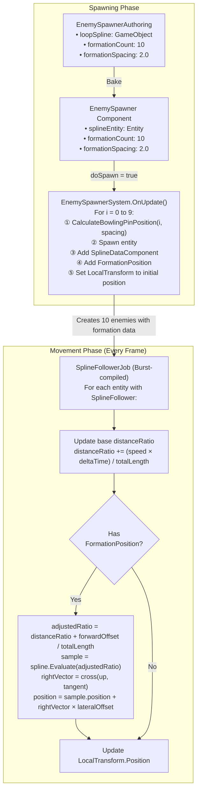

# Bowling Pin Formation - Visual Diagram

## Formation Layout (Top View)

```
Direction of Travel →

                        Spline Path (center line)
                               |
       [0]                     |              Row 0 (back)
         ●                     |              
                               |
      [1] [2]                  |              Row 1
       ●   ●                   |
                               |
    [3] [4] [5]                |              Row 2
     ●   ●   ●                 |
                               |
  [6] [7] [8] [9]              |              Row 3 (front)
   ●   ●   ●   ●               |

   ← lateralOffset → 
        (left/right)

   ↑ forwardOffset
   (distance along spline)
```

## Position Offsets (spacing = 2.0)

### Row 0 (Position 0)
- Forward offset: 0
- Lateral offset: 0
- Position on spline: Base position

### Row 1 (Positions 1-2)
- Forward offset: -2.0
- Lateral offsets: -0.866, +0.866
- Position on spline: 2 units behind base

### Row 2 (Positions 3-5)
- Forward offset: -4.0
- Lateral offsets: -1.732, 0, +1.732
- Position on spline: 4 units behind base

### Row 3 (Positions 6-9)
- Forward offset: -6.0
- Lateral offsets: -2.598, -0.866, +0.866, +2.598
- Position on spline: 6 units behind base

## Movement Along Spline (Side View)

```
Spline Path
━━━━━━━━━━━━━━━━━━━━━━━━━━━━━━━━━━━━━━━━━━━→

Time T=0:
       [0]
      [1][2]
    [3][4][5]
  [6][7][8][9]

Time T=1:
              [0]
             [1][2]
           [3][4][5]
         [6][7][8][9]

Time T=2:
                     [0]
                    [1][2]
                  [3][4][5]
                [6][7][8][9]

Formation maintains shape while moving along the spline!
```

## Component Data Flow



## Coordinate System

```
Unity Coordinate System (Right-handed)

        Y (Up)
        │
        │
        │
        └────── X (Right)
       ╱
      ╱
     Z (Forward)

Spline Tangent = Forward direction of movement
Up Vector = Y axis (usually)
Right Vector = cross(Up, Tangent) = Perpendicular to path

lateralOffset.x applied along Right Vector
forwardOffset applied along Tangent (via distanceRatio)
```

## Example Calculation

For Position Index 7 (Row 3, second from left) with spacing = 2.0:

1. Determine row: `row = 3` (positions 6-9 are row 3)
2. Position in row: `7 - 6 = 1` (second position)
3. Pins in row: `3 + 1 = 4` pins

Forward offset:
```
forwardOffset = -row * spacing
             = -3 * 2.0
             = -6.0 units
```

Lateral offset:
```
hexagonalSpacing = spacing * 0.866 = 1.732
lateralOffset = (1 - (4-1)*0.5) * 1.732
             = (1 - 1.5) * 1.732
             = -0.5 * 1.732
             = -0.866 units (left of center)
```

Result: Position 7 is:
- 6 units behind the lead position
- 0.866 units to the left of the spline path

## Performance Characteristics

| Feature | Detail |
|---------|--------|
| ✅ Burst Compiled | Ultra-fast SIMD |
| ✅ Job System | Parallel processing |
| ✅ Component Lookup | O(1) access |
| ✅ Blob Assets | Zero GC allocations |
| ✅ Cache Friendly | Contiguous memory |

**Expected Performance:**
- Can handle hundreds of formations simultaneously
- No per-frame allocations
- Minimal CPU overhead per entity
- Scales linearly with entity count

## Key Insights

1. **Shared Base Movement**: All entities in a formation share the same `distanceRatio`, ensuring synchronized movement.

2. **Offset Application**: Offsets are applied AFTER base movement calculation:
   - Forward offset modifies which point on the spline to sample
   - Lateral offset adds perpendicular displacement from that point

3. **Coordinate Space**: All calculations happen in world space, using the spline's transformation matrix.

4. **Formation Integrity**: Because offsets are relative to the spline tangent, the formation shape is maintained even on curved paths.

5. **Flexibility**: Entities can be added/removed from formation by adding/removing the `FormationPosition` component at runtime.

