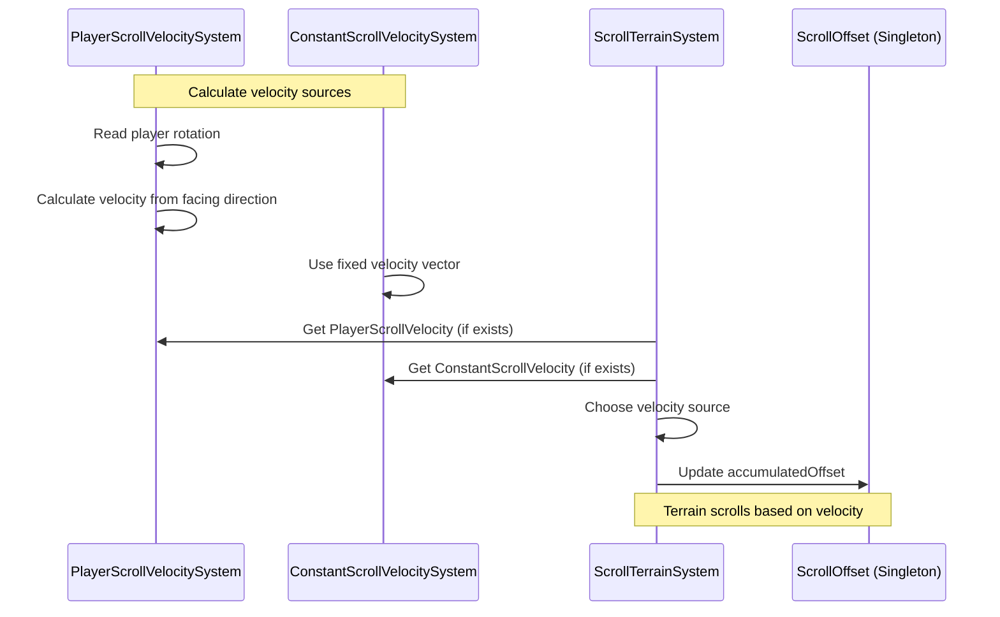

# Auto-Scrolling Terrain Guide
**Version:** 3.0  
**Last Updated:** May 4, 2026

Complete guide to the automatic terrain scrolling feature for endless runner gameplay.

## What is Auto-Scrolling Terrain?

Auto-scrolling terrain creates an "endless runner" effect where the terrain continuously moves through a fixed player position. The player stays stationary while the world scrolls around them.

### Perfect for VR
- Player GameObject doesn't move (no motion sickness)
- Visual flow creates sense of movement
- Terrain scrolls in the direction player is facing
- Smooth, predictable motion

### Use Cases
- Endless runner games
- Racing games
- Flight simulators
- On-rails experiences
- Meditation/relaxation apps

## How It Works

### The Scrolling Mechanism

```
Traditional Movement:          Auto-Scrolling Terrain:
Player moves forward    →      Player stays fixed
Terrain is static       →      Terrain moves backward

Result: Same visual experience, but player never moves!
```

### Technical Implementation

1. **ScrollTerrainSystem** updates `ScrollOffset.accumulatedOffset` each frame
   - Direction: Player's forward vector projected onto XZ plane
   - Distance: `scrollSpeed × deltaTime` accumulated over time

2. **TileScrollPositionSystem** updates all tile positions
   - Formula: `tilePosition = baseGridPosition - scrollOffset`
   - Effect: Tiles move opposite to scroll direction

3. **TileSpawningSystem** spawns tiles accounting for scroll
   - Uses "effective position" = `playerPosition + scrollOffset`
   - Tiles spawn ahead of player, despawn behind

### Visual Effect

```
Frame 1:   Player at (0, 0), ScrollOffset = 0
           [Tile -1] [Tile 0] [Tile 1] [Tile 2]
                        👤

Frame 2:   Player at (0, 0), ScrollOffset = 5m
           [Tile -1] [Tile 0] [Tile 1] [Tile 2]
                    👤

Frame 3:   Player at (0, 0), ScrollOffset = 10m
           [Tile 0] [Tile 1] [Tile 2] [Tile 3]
                👤
           (Tile -1 despawned, Tile 3 spawned)
```

## Configuration

### Basic Setup

In `TerrainConfigAuthoring`:

**Enable Scrolling**:
```
Scroll Enabled: ✅ (checked)
Scroll Speed: 5.0
```

### Scroll Speed Values

**Walking Speed**: `3 - 5 m/s` (10-18 km/h)
- Gentle, relaxed pace
- Good for exploration or meditation apps

**Running Speed**: `8 - 12 m/s` (28-43 km/h)
- Moderate pace
- Good for standard endless runners

**Vehicle Speed**: `20 - 40 m/s` (72-144 km/h)
- Fast pace
- Good for racing or flight games

**Negative Values**: Scroll backward
- `-5.0` = Moving backward through terrain

### Direction Control

Scroll direction is determined by **player's forward facing direction** (XZ plane):

- Player faces +Z → Terrain scrolls in +Z direction
- Player faces +X → Terrain scrolls in +X direction
- Player rotates → Scroll direction changes

**Important**: Scroll is always locked to XZ plane (horizontal), Y component ignored.

---

## Scroll Velocity Components (v3.0)

**NEW in v3.0:** Flexible scroll velocity sources for enhanced gameplay control.

### Architecture Overview

The scroll system now supports multiple velocity sources through component-based architecture:



### Two Velocity Sources

#### 1. Player-Based Velocity (PlayerScrollVelocitySystem)

**Purpose:** Terrain scrolls in the direction the player is facing (rotation-based).

**Configuration:**
```csharp
// Add PlayerScrollVelocityAuthoring to GameObject
// (Can be same GameObject as TerrainConfigAuthoring or separate)
```

**Inspector Settings:**
- `scrollSpeed` - Base scroll speed (m/s)
- `useVerticalRotation` - Include vertical facing in scroll direction
- `verticalInfluence` - How much vertical affects scroll (0-1)

**Behavior:**
- Scroll direction = Player's forward vector (XZ plane by default)
- Player rotates → Scroll direction changes
- Perfect for exploration games
- Default if no velocity component exists

**Example Use Cases:**
- VR walking simulator (player looks around, terrain scrolls forward)
- Railshooter (player aims, terrain scrolls in look direction)
- Meditation apps (player controls scroll with head movement)

#### 2. Constant Velocity (ConstantScrollVelocitySystem)

**Purpose:** Fixed scroll velocity regardless of player rotation.

**Configuration:**
```csharp
// Add ConstantScrollVelocityAuthoring to GameObject
```

**Inspector Settings:**
- `velocityVector` - Fixed scroll direction and speed (float3)
- `scrollSpeed` - Speed multiplier (m/s)

**Behavior:**
- Scroll direction = Fixed vector (e.g., always +Z)
- Player rotates → Scroll direction unchanged
- Perfect for racing/runner games

**Example Use Cases:**
- Racing game (always scroll forward at constant speed)
- Endless runner (fixed direction regardless of player)
- On-rails shooter (predetermined path)

### Combining Velocity Sources

**Priority Order:**
1. If `ConstantScrollVelocity` exists → Use constant velocity
2. Else if `PlayerScrollVelocity` exists → Use player-based velocity
3. Else → Use ScrollConfig default (player forward)

**Example Configuration:**
```
// Scenario: Racing game with turbo boost

GameObject: TerrainConfig
  ├─ TerrainConfigAuthoring (scroll configuration)
  └─ ConstantScrollVelocityAuthoring
     ├─ velocityVector: (0, 0, 1) // Always forward
     └─ scrollSpeed: 20 m/s // Base racing speed

// When boost activated:
// Dynamically increase scrollSpeed to 40 m/s via code
```

### Switching Velocity Sources at Runtime

```csharp
using Unity.Entities;

public class ScrollVelocityController : MonoBehaviour
{
    public void SwitchToConstantVelocity(float3 direction, float speed)
    {
        var world = World.DefaultGameObjectInjectionWorld;
        var em = world.EntityManager;
        
        // Find or create ConstantScrollVelocity singleton
        var query = em.CreateEntityQuery(typeof(ConstantScrollVelocity));
        Entity entity;
        
        if (query.CalculateEntityCount() == 0)
        {
            // Create new singleton
            entity = em.CreateEntity(typeof(ConstantScrollVelocity));
        }
        else
        {
            entity = query.GetSingletonEntity();
        }
        
        em.SetComponentData(entity, new ConstantScrollVelocity
        {
            velocityVector = direction,
            scrollSpeed = speed
        });
        
        query.Dispose();
    }
    
    public void RemoveConstantVelocity()
    {
        var world = World.DefaultGameObjectInjectionWorld;
        var em = world.EntityManager;
        
        var query = em.CreateEntityQuery(typeof(ConstantScrollVelocity));
        if (query.CalculateEntityCount() > 0)
        {
            em.DestroyEntity(query.GetSingletonEntity());
        }
        query.Dispose();
        
        // Falls back to PlayerScrollVelocity or default
    }
}
```

### Configuration Examples

#### Example 1: VR Exploration (Player-Based)

```
GameObject: TerrainConfig
  ├─ TerrainConfigAuthoring
  │  ├─ Scroll Enabled: ✅
  │  └─ Scroll Speed: 5.0 m/s
  └─ PlayerScrollVelocityAuthoring
     ├─ scrollSpeed: 5.0 m/s
     ├─ useVerticalRotation: ❌
     └─ verticalInfluence: 0.0
```

**Result:** Terrain scrolls forward in direction player is facing (horizontal only).

#### Example 2: Racing Game (Constant Velocity)

```
GameObject: TerrainConfig
  ├─ TerrainConfigAuthoring
  │  ├─ Scroll Enabled: ✅
  │  └─ Scroll Speed: 25.0 m/s
  └─ ConstantScrollVelocityAuthoring
     ├─ velocityVector: (0, 0, 1) // Always +Z
     └─ scrollSpeed: 25.0 m/s
```

**Result:** Terrain scrolls forward at constant 25 m/s regardless of player rotation.

#### Example 3: Flight Simulator (Player-Based with Vertical)

```
GameObject: TerrainConfig
  ├─ TerrainConfigAuthoring
  │  ├─ Scroll Enabled: ✅
  │  └─ Scroll Speed: 30.0 m/s
  └─ PlayerScrollVelocityAuthoring
     ├─ scrollSpeed: 30.0 m/s
     ├─ useVerticalRotation: ✅
     └─ verticalInfluence: 0.5
```

**Result:** Terrain scrolls in 3D direction with 50% vertical influence (fly up/down).

---

## Runtime Control

### Enable/Disable Scrolling at Runtime

```csharp
using Unity.Entities;

public void SetScrolling(bool enabled)
{
    var world = World.DefaultGameObjectInjectionWorld;
    var em = world.EntityManager;
    
    // Get scroll config singleton
    var query = em.CreateEntityQuery(typeof(ScrollConfig));
    var entity = query.GetSingletonEntity();
    var config = em.GetComponentData<ScrollConfig>(entity);
    
    // Update enabled state
    config.enabled = enabled;
    em.SetComponentData(entity, config);
    
    query.Dispose();
}
```

### Change Scroll Speed at Runtime

```csharp
public void SetScrollSpeed(float speed)
{
    var world = World.DefaultGameObjectInjectionWorld;
    var em = world.EntityManager;
    
    var query = em.CreateEntityQuery(typeof(ScrollConfig));
    var entity = query.GetSingletonEntity();
    var config = em.GetComponentData<ScrollConfig>(entity);
    
    config.scrollSpeed = speed;
    em.SetComponentData(entity, config);
    
    query.Dispose();
}
```

### Reset Scroll Offset

```csharp
public void ResetScrollPosition()
{
    var world = World.DefaultGameObjectInjectionWorld;
    var em = world.EntityManager;
    
    var query = em.CreateEntityQuery(typeof(ScrollOffset));
    var entity = query.GetSingletonEntity();
    
    // Reset to zero
    em.SetComponentData(entity, new ScrollOffset 
    { 
        accumulatedOffset = float3.zero 
    });
    
    query.Dispose();
}
```

### Get Current Scroll Distance

```csharp
public float GetScrollDistance()
{
    var world = World.DefaultGameObjectInjectionWorld;
    var em = world.EntityManager;
    
    var query = em.CreateEntityQuery(typeof(ScrollOffset));
    var entity = query.GetSingletonEntity();
    var offset = em.GetComponentData<ScrollOffset>(entity);
    query.Dispose();
    
    // Return magnitude of scroll vector
    return math.length(offset.accumulatedOffset);
}
```

## Advanced Features

### Dynamic Speed Changes

Create smooth acceleration/deceleration:

```csharp
public class TerrainScrollController : MonoBehaviour
{
    private float _currentSpeed = 0f;
    private float _targetSpeed = 10f;
    private float _acceleration = 2f; // m/s²
    
    void Update()
    {
        // Smoothly accelerate toward target
        _currentSpeed = Mathf.MoveTowards(
            _currentSpeed, 
            _targetSpeed, 
            _acceleration * Time.deltaTime
        );
        
        SetScrollSpeed(_currentSpeed);
    }
    
    public void Accelerate() => _targetSpeed = 20f;
    public void Decelerate() => _targetSpeed = 5f;
    public void Stop() => _targetSpeed = 0f;
}
```

### Curved Paths

To make terrain scroll along curved paths, rotate the player GameObject:

```csharp
public class CurvedScrollPath : MonoBehaviour
{
    public float turnSpeed = 10f; // Degrees per second
    
    void Update()
    {
        // Rotate player gradually
        transform.Rotate(0, turnSpeed * Time.deltaTime, 0);
        
        // Terrain scroll direction follows player rotation
    }
}
```

### Distance-Based Events

Trigger events at specific scroll distances:

```csharp
public class ScrollDistanceEvents : MonoBehaviour
{
    private float _lastCheckpoint = 0f;
    private float _checkpointInterval = 100f; // Every 100m
    
    void Update()
    {
        float distance = GetScrollDistance();
        
        if (distance >= _lastCheckpoint + _checkpointInterval)
        {
            _lastCheckpoint = distance;
            OnCheckpoint(distance);
        }
    }
    
    void OnCheckpoint(float distance)
    {
        Debug.Log($"Checkpoint reached at {distance}m!");
        // Spawn obstacles, increase difficulty, etc.
    }
}
```

## Design Patterns

### Pattern 1: Fixed Speed Runner
**Player stays fixed, terrain scrolls at constant speed**

```
Scroll Enabled: true
Scroll Speed: 10.0 (constant)
Player Position: Fixed at (0, 0, 0)
```

**Good for**: Traditional endless runners, meditation apps

---

### Pattern 2: Player-Controlled Speed
**Player input controls scroll speed**

```csharp
void Update()
{
    float inputSpeed = Input.GetAxis("Vertical") * 20f;
    SetScrollSpeed(inputSpeed);
}
```

**Good for**: Racing games, flight sims

---

### Pattern 3: Rhythm-Based
**Scroll speed synced to music tempo**

```csharp
void OnBeat()
{
    SetScrollSpeed(baseBPM * beatMultiplier / 60f);
}
```

**Good for**: Rhythm games, audio-reactive experiences

---

### Pattern 4: Hybrid Scrolling + Manual Control
**Terrain scrolls but player can still move freely**

```csharp
// Terrain scrolls at base speed
Scroll Speed: 5.0

// Player can also move manually
playerTransform.position += playerInput * moveSpeed * Time.deltaTime;

// Result: Player moves relative to scrolling terrain
```

**Good for**: Runner games with lane switching, obstacle avoidance

---

## Performance Considerations

### CPU Cost
**ScrollTerrainSystem**: <0.01ms per frame (trivial)
- Just updates one float3 value

**TileScrollPositionSystem**: ~0.05ms per frame
- Updates LocalTransform for all active tiles
- Scales with number of tiles (view distance)

**Tile Spawning**: Same cost as non-scrolling
- Tiles spawn/despawn based on effective position

### Memory Cost
**Zero additional memory** - scrolling uses existing systems

### Frame Rate Impact
**Negligible** - scrolling itself doesn't affect performance
- Physics and rendering costs same as non-scrolling mode

## Common Mistakes

### ❌ Moving Player AND Scrolling Terrain
**Problem**: Both player position changes AND scroll enabled
**Result**: Confusing double movement, tiles spawn incorrectly
**Solution**: Choose one - either move player OR enable scrolling

### ❌ Scroll Speed Too Fast
**Problem**: Scroll Speed = 100 m/s
**Result**: Tiles can't spawn fast enough, gaps in terrain
**Solution**: Keep speed < 50 m/s, increase view distance if needed

### ❌ Wrong Player Forward
**Problem**: Player forward direction is up/down (Y axis)
**Result**: No scrolling (projected onto XZ = zero)
**Solution**: Ensure player forward is in XZ plane

### ❌ Forgetting to Enable
**Problem**: Set scroll speed but forgot to enable
**Result**: No scrolling happens
**Solution**: Check both `Scroll Enabled` AND `Scroll Speed > 0`

## Debugging Scrolling

### Visual Indicators

Add `TerrainTileGizmoVisualizer` and enable "Draw Grid Coordinates":
- Tile coordinate numbers should change as terrain scrolls
- Grid (0, 0) moves relative to player

### Console Logging

Uncomment debug logging in `ScrollTerrainSystem.cs`:

```csharp
#if UNITY_EDITOR
float totalDistance = math.length(scrollOffset.ValueRO.accumulatedOffset);
if (totalDistance % 100f < config.scrollSpeed * SystemAPI.Time.DeltaTime)
{
    UnityEngine.Debug.Log($"ScrollTerrainSystem: Scrolled {totalDistance:F1}m in direction {scrollDirection}");
}
#endif
```

**Output**: Logs every 100m scrolled with direction vector

### Runtime Inspection

Check scroll values at runtime:

```csharp
[ContextMenu("Log Scroll Status")]
public void LogScrollStatus()
{
    var world = World.DefaultGameObjectInjectionWorld;
    var em = world.EntityManager;
    
    // Get config
    var configQuery = em.CreateEntityQuery(typeof(ScrollConfig));
    var config = em.GetComponentData<ScrollConfig>(configQuery.GetSingletonEntity());
    Debug.Log($"Scroll Enabled: {config.enabled}, Speed: {config.scrollSpeed}");
    configQuery.Dispose();
    
    // Get offset
    var offsetQuery = em.CreateEntityQuery(typeof(ScrollOffset));
    var offset = em.GetComponentData<ScrollOffset>(offsetQuery.GetSingletonEntity());
    Debug.Log($"Accumulated Offset: {offset.accumulatedOffset}");
    Debug.Log($"Total Distance: {math.length(offset.accumulatedOffset)}m");
    offsetQuery.Dispose();
}
```

## Integration Examples

### Example 1: Simple Endless Runner

```csharp
using UnityEngine;
using Unity.Entities;
using Unity.Mathematics;

public class SimpleRunner : MonoBehaviour
{
    [SerializeField] private float scrollSpeed = 10f;
    
    void Start()
    {
        EnableScrolling(scrollSpeed);
    }
    
    void EnableScrolling(float speed)
    {
        var world = World.DefaultGameObjectInjectionWorld;
        var em = world.EntityManager;
        var query = em.CreateEntityQuery(typeof(ScrollConfig));
        var entity = query.GetSingletonEntity();
        
        em.SetComponentData(entity, new ScrollConfig 
        { 
            enabled = true, 
            scrollSpeed = speed 
        });
        
        query.Dispose();
    }
}
```

### Example 2: Accelerating Difficulty

```csharp
public class AcceleratingRunner : MonoBehaviour
{
    [SerializeField] private float startSpeed = 5f;
    [SerializeField] private float maxSpeed = 30f;
    [SerializeField] private float accelerationPerMinute = 5f;
    
    private float _currentSpeed;
    
    void Start()
    {
        _currentSpeed = startSpeed;
        EnableScrolling(_currentSpeed);
    }
    
    void Update()
    {
        // Gradually increase speed
        _currentSpeed = Mathf.Min(
            _currentSpeed + accelerationPerMinute * Time.deltaTime / 60f,
            maxSpeed
        );
        
        SetScrollSpeed(_currentSpeed);
    }
}
```

### Example 3: Input-Controlled Speed

```csharp
public class PlayerControlledScroll : MonoBehaviour
{
    [SerializeField] private float maxSpeed = 20f;
    
    void Update()
    {
        // Vertical input controls speed
        float inputAxis = Input.GetAxis("Vertical");
        float speed = inputAxis * maxSpeed;
        
        SetScrollSpeed(speed);
    }
}
```

### Example 4: Start/Stop Control

```csharp
public class ScrollToggle : MonoBehaviour
{
    private bool _isScrolling = false;
    
    void Update()
    {
        if (Input.GetKeyDown(KeyCode.Space))
        {
            _isScrolling = !_isScrolling;
            
            if (_isScrolling)
                StartScrolling();
            else
                StopScrolling();
        }
    }
    
    void StartScrolling()
    {
        var world = World.DefaultGameObjectInjectionWorld;
        var em = world.EntityManager;
        var query = em.CreateEntityQuery(typeof(ScrollConfig));
        var entity = query.GetSingletonEntity();
        
        em.SetComponentData(entity, new ScrollConfig 
        { 
            enabled = true, 
            scrollSpeed = 10f 
        });
        
        query.Dispose();
    }
    
    void StopScrolling()
    {
        var world = World.DefaultGameObjectInjectionWorld;
        var em = world.EntityManager;
        var query = em.CreateEntityQuery(typeof(ScrollConfig));
        var entity = query.GetSingletonEntity();
        
        var config = em.GetComponentData<ScrollConfig>(entity);
        config.enabled = false;
        em.SetComponentData(entity, config);
        
        query.Dispose();
    }
}
```

## System Deep Dive

### ScrollTerrainSystem

**File**: `ScrollTerrainSystem.cs`  
**Update Group**: SimulationSystemGroup  
**Update Order**: Before TileSpawningSystem

**Responsibilities**:
1. Read `ScrollConfig` to check if enabled
2. Read `PlayerTransformReference` to get forward direction
3. Update `ScrollOffset.accumulatedOffset` each frame

**Code Walkthrough**:
```csharp
// Get player forward, project onto XZ plane
Vector3 forward = playerRef.playerTransform.forward;
float3 scrollDirection = math.normalize(new float3(forward.x, 0, forward.z));

// Accumulate distance
float scrollDelta = config.scrollSpeed * SystemAPI.Time.DeltaTime;
scrollOffset.ValueRW.accumulatedOffset += scrollDirection * scrollDelta;
```

**Key Points**:
- Y component always zero (horizontal scrolling only)
- Direction updates if player rotates
- Accumulates infinitely (no overflow in practice)

---

### TileScrollPositionSystem

**File**: `TileScrollPositionSystem.cs`  
**Update Group**: SimulationSystemGroup  
**Update Order**: After ScrollTerrainSystem, before TransformSystemGroup

**Responsibilities**:
1. Read `ScrollOffset` singleton
2. Update all tile `LocalTransform.Position` values
3. Apply scroll by subtracting offset from base grid position

**Code Walkthrough**:
```csharp
// Calculate base position from grid coordinates
float3 basePosition = new float3(
    tile.ValueRO.gridCoordinate.x * tileConfig.tileSize,
    0,
    tile.ValueRO.gridCoordinate.y * tileConfig.tileSize
);

// Apply scroll offset (subtract to move tiles opposite to scroll)
transform.ValueRW.Position = basePosition - scrollOffset.accumulatedOffset;
```

**Key Points**:
- Runs every frame for all tiles
- Very fast (Burst-compiled, simple subtraction)
- Tiles physically move, collision detection unaffected

---

### TileSpawningSystem (Modified Behavior)

When scrolling is enabled, TileSpawningSystem uses "effective player position":

```csharp
// Effective position accounts for scroll
float3 effectivePlayerPosition = playerPosition + scrollOffset.accumulatedOffset;

// Calculate grid coordinate based on effective position
int2 playerGridCoord = new int2(
    (int)math.floor(effectivePlayerPosition.x / config.tileSize),
    (int)math.floor(effectivePlayerPosition.z / config.tileSize)
);
```

**Effect**: System spawns tiles as if player moved, even though player is stationary.

## Gameplay Integration

### Obstacle Spawning

Spawn obstacles at scroll distance checkpoints:

```csharp
public class ObstacleSpawner : MonoBehaviour
{
    [SerializeField] private GameObject obstaclePrefab;
    [SerializeField] private float spawnInterval = 50f; // Every 50m
    
    private float _lastSpawnDistance = 0f;
    
    void Update()
    {
        float currentDistance = GetScrollDistance();
        
        if (currentDistance >= _lastSpawnDistance + spawnInterval)
        {
            SpawnObstacle();
            _lastSpawnDistance = currentDistance;
        }
    }
    
    void SpawnObstacle()
    {
        // Spawn ahead of player
        Vector3 spawnPosition = Vector3.forward * 100f;
        Instantiate(obstaclePrefab, spawnPosition, Quaternion.identity);
    }
}
```

### Score Based on Distance

```csharp
public class DistanceScore : MonoBehaviour
{
    private float _score;
    
    void Update()
    {
        _score = GetScrollDistance();
        UpdateScoreUI(_score);
    }
}
```

### Difficulty Scaling

```csharp
public class DifficultyScaling : MonoBehaviour
{
    void Update()
    {
        float distance = GetScrollDistance();
        
        // Increase speed every 200m
        float targetSpeed = 10f + Mathf.Floor(distance / 200f) * 2f;
        targetSpeed = Mathf.Min(targetSpeed, 30f); // Cap at 30 m/s
        
        SetScrollSpeed(targetSpeed);
    }
}
```

## VR Considerations

### Motion Sickness Prevention

✅ **Player stays fixed** - No camera translation  
✅ **Smooth constant motion** - No sudden accelerations  
✅ **Vignette effects** - Reduce peripheral vision at high speeds  
✅ **Limit max speed** - Keep under 30 m/s for comfort  

❌ **Avoid sudden direction changes** - Causes disorientation  
❌ **Avoid backward scrolling** - Counterintuitive movement  
❌ **Avoid speed spikes** - Use smooth acceleration  

### Comfort Features

Add optional comfort mode:

```csharp
public class VRComfortMode : MonoBehaviour
{
    [SerializeField] private bool comfortMode = true;
    [SerializeField] private float maxComfortSpeed = 15f;
    
    public void SetScrollSpeed(float speed)
    {
        if (comfortMode)
        {
            speed = Mathf.Min(speed, maxComfortSpeed);
        }
        
        // Apply speed...
    }
}
```

## Performance Impact

### CPU Usage
- **ScrollTerrainSystem**: <0.01ms (negligible)
- **TileScrollPositionSystem**: ~0.05ms (very low)
- **Total overhead**: <0.1ms per frame

### Memory Usage
- **ScrollOffset**: 12 bytes (one float3)
- **ScrollConfig**: 8 bytes (one float + bool)
- **Total overhead**: 20 bytes

### Frame Rate
**No measurable impact** on frame rate from scrolling feature itself.

## Troubleshooting

### Terrain Not Scrolling

**Check**:
1. Is `Scroll Enabled` checked?
2. Is `Scroll Speed` > 0?
3. Is player forward direction valid (not straight up/down)?
4. Check console for ScrollTerrainSystem errors

**Debug**:
- Add TerrainTrackingDebugger, check if PlayerTransformReference is valid
- Uncomment debug logs in ScrollTerrainSystem
- Verify ScrollOffset is increasing each frame

### Terrain Scrolls Wrong Direction

**Cause**: Player forward direction unexpected

**Solution**: 
- Verify player GameObject forward (blue arrow in Scene view)
- System uses XZ plane projection, ignores Y
- Rotate player GameObject to change direction

### Gaps in Terrain

**Cause**: Scroll speed too fast, tiles can't spawn quickly enough

**Solutions**:
1. Reduce scroll speed
2. Increase view distance (spawn tiles farther ahead)
3. Increase tile spawning budget

### Stuttering Motion

**Cause**: Frame rate drops, inconsistent deltaTime

**Solutions**:
1. Optimize terrain settings (reduce vertices, view distance)
2. Increase frame budgets for mesh/collider creation
3. Check VSync settings

## Related Documentation

- **[Configuration Reference](CONFIGURATION.md)** - All configuration parameters
- **[System Pipeline](SYSTEM_PIPELINE.md)** - How scrolling fits into system execution
- **[Technical Details](TECHNICAL_DETAILS.md)** - Implementation details
- **[Performance Optimization](PERFORMANCE.md)** - Optimizing scroll performance

---

**Back to**: [Documentation Hub](README.md)

