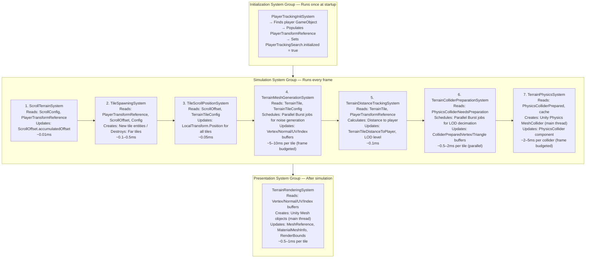
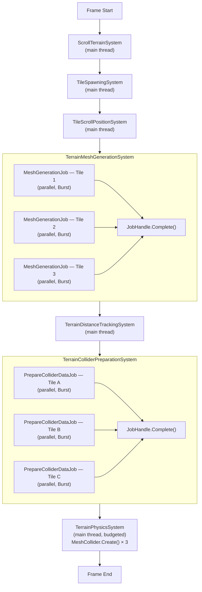
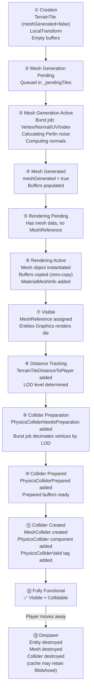
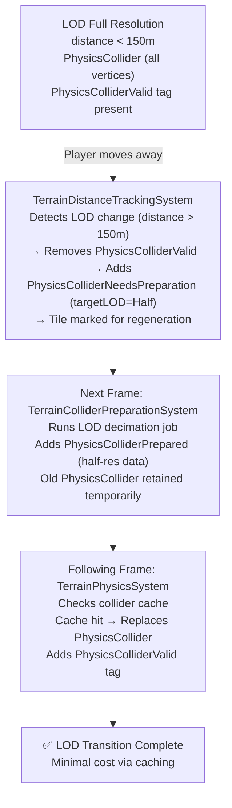

# System Pipeline - Execution Order and Data Flow

Detailed documentation of how all terrain systems execute and interact each frame.

## System Update Order

The terrain system consists of 8 systems that run in a carefully orchestrated order:



## Frame-by-Frame Walkthrough

### Frame 1: First Frame After Load

```
PlayerTrackingInitSystem:
  ├─ Searches for player: "XR Origin Hands (XR Rig)"
  ├─ Found: Transform at (0, 1.5, 0)
  └─ PlayerTransformReference.playerTransform = found Transform

ScrollTerrainSystem:
  ├─ ScrollConfig.enabled = false
  └─ (Skips update)

TileSpawningSystem:
  ├─ PlayerTransformReference.playerTransform at (0, 1.5, 0)
  ├─ View distance = 500m, tile size = 100m
  ├─ Spawns tiles: (-2,-2) through (2,2) = 25 tiles
  ├─ For each tile:
  │  ├─ Creates entity
  │  ├─ Adds LocalTransform (position at grid coordinate)
  │  ├─ Adds TerrainTile (gridCoordinate, meshGenerated = false)
  │  └─ Adds empty buffers (Vertex, Normal, UV, Index)
  └─ Total tiles: 25

TerrainMeshGenerationSystem:
  ├─ Queries tiles with meshGenerated = false
  ├─ Found: 25 tiles need meshes
  ├─ Frame budget: 3 tiles per frame
  ├─ Prioritizes by camera distance/direction
  ├─ Processes top 3 priority tiles:
  │  ├─ Schedules Burst job for each
  │  ├─ Generates 1024 vertices (32×32)
  │  ├─ Calculates Perlin noise heights
  │  ├─ Computes normals
  │  └─ Sets meshGenerated = true
  └─ Remaining 22 tiles queued for next frames

TerrainRenderingSystem:
  ├─ Queries tiles with meshGenerated = true, no MeshReference
  ├─ Found: 3 tiles ready
  ├─ For each tile:
  │  ├─ Creates Unity Mesh
  │  ├─ Copies buffer data (zero-copy via Reinterpret)
  │  ├─ Adds MaterialMeshInfo
  │  └─ Adds RenderBounds
  └─ Terrain now visible!

TerrainDistanceTrackingSystem:
  ├─ Calculates distance for all 25 tiles
  ├─ Determines LOD levels
  ├─ Marks tiles needing colliders
  └─ Adds PhysicsColliderNeedsPreparation

TerrainColliderPreparationSystem:
  ├─ Found: 3 tiles need colliders
  ├─ Schedules Burst jobs for LOD decimation
  └─ Adds PhysicsColliderPrepared

TerrainPhysicsSystem:
  ├─ Found: 3 tiles prepared
  ├─ Frame budget: 3 colliders per frame
  ├─ Creates MeshCollider for each
  ├─ Adds PhysicsCollider component
  └─ Terrain now collidable!
```

**Frame 1 Result**: 3 tiles fully functional (visible + collidable), 22 tiles pending

---

### Frames 2-9: Steady State Mesh Generation

```
Frame N:
  ScrollTerrainSystem: (disabled)
  TileSpawningSystem: No new tiles (player hasn't moved)
  
  TerrainMeshGenerationSystem:
    ├─ Processes 3 tiles from queue
    └─ 22 → 19 → 16 → ... → 1 → 0 tiles remaining
  
  TerrainRenderingSystem:
    ├─ Renders 3 newly generated tiles
    └─ Total rendered: 6, 9, 12, ... 25
  
  TerrainPhysicsSystem:
    ├─ Creates 3 colliders
    └─ Total collidable: 6, 9, 12, ... 25
```

**After Frame 9**: All 25 tiles generated, rendered, and collidable

---

### Frame 10+: Player Moves

```
Player moves to (50, 0, 50):

TileSpawningSystem:
  ├─ Detects new player grid position
  ├─ Calculates new required tiles
  ├─ Spawns 8 new tiles (entering view)
  ├─ Despawns 8 old tiles (exiting view)
  └─ Total tiles: still ~25 (circular culling)

TerrainMeshGenerationSystem:
  ├─ 8 new tiles added to queue
  ├─ Processes 3 tiles this frame
  └─ 5 tiles remain in queue

TerrainDistanceTrackingSystem:
  ├─ All tiles recalculate distance to new player position
  ├─ Some tiles change LOD level
  └─ Marks tiles for collider regeneration

TerrainPhysicsSystem:
  ├─ Regenerates colliders for LOD-changed tiles
  ├─ Cache hits: Instant (most cases)
  └─ Cache miss: 2-5ms (rare)
```

---

### With Auto-Scrolling Enabled

```
ScrollTerrainSystem:
  ├─ Player facing: (0, 0, 1) normalized
  ├─ Scroll speed: 10 m/s
  ├─ Delta: 10 * 0.016 = 0.16m this frame
  └─ ScrollOffset.accumulatedOffset += (0, 0, 0.16)

TileScrollPositionSystem:
  ├─ For each tile:
  │  ├─ Base position: gridCoord * tileSize
  │  └─ Final position: base - scrollOffset
  └─ All tiles move slightly backward

TileSpawningSystem:
  ├─ Effective player position: playerPos + scrollOffset
  ├─ Effective position increases → grid coordinate changes
  ├─ New tiles spawn ahead (higher Z)
  └─ Old tiles despawn behind (lower Z)

Result: Terrain continuously scrolls forward
```

## Data Dependencies

### Singleton Dependencies

Every system requires at least one singleton:

```
PlayerTrackingInitSystem:
  Requires: PlayerTrackingSearch, PlayerTransformReference

ScrollTerrainSystem:
  Requires: ScrollConfig, ScrollOffset, PlayerTransformReference

TileSpawningSystem:
  Requires: PlayerTransformReference, TerrainTileConfig, ScrollOffset

TileScrollPositionSystem:
  Requires: ScrollConfig, ScrollOffset, TerrainTileConfig

TerrainMeshGenerationSystem:
  Requires: TerrainTileConfig

TerrainDistanceTrackingSystem:
  Requires: TerrainTileConfig, PlayerTransformReference

TerrainColliderPreparationSystem:
  Requires: TerrainTileConfig

TerrainPhysicsSystem:
  Requires: TerrainTileConfig

TerrainRenderingSystem:
  Requires: TerrainTileConfig
```

### Component Dependencies

Per-tile entity component lifecycle:

```
Tile Creation:
  Entity created
  └─ TerrainTile (gridCoordinate, meshGenerated = false)
  └─ LocalTransform (position)
  └─ LocalToWorld (transform matrix)
  └─ Empty buffers (Vertex, Normal, UV, Index)

After Mesh Generation:
  └─ Buffers populated with mesh data
  └─ TerrainTile.meshGenerated = true

After Rendering Setup:
  └─ MeshReference (Unity Mesh)
  └─ MaterialMeshInfo (rendering metadata)
  └─ RenderBounds (culling bounds)

After Distance Tracking:
  └─ TerrainTileDistanceToPlayer (distance, LOD level)
  └─ PhysicsColliderNeedsPreparation (if needs collider)

After Collider Preparation:
  └─ ColliderPreparedVertexElement buffer
  └─ ColliderPreparedTriangleElement buffer
  └─ PhysicsColliderPrepared (priority)

After Physics Creation:
  └─ PhysicsCollider (Unity Physics collider)
  └─ PhysicsColliderValid (tag)
  └─ Prepared buffers removed
```

## System Interactions

### ScrollTerrainSystem → TileSpawningSystem

**Data Flow**: `ScrollOffset` updated by ScrollTerrainSystem, read by TileSpawningSystem

**Effect**: Spawning system uses effective position (player + scroll) for grid calculations

---

### TileSpawningSystem → TileScrollPositionSystem

**Data Flow**: Tiles created with base grid positions, updated by scroll position system

**Effect**: Newly spawned tiles immediately get scroll offset applied

---

### TileSpawningSystem → TerrainMeshGenerationSystem

**Data Flow**: New tiles have empty mesh buffers, generation system fills them

**Effect**: Queue-based processing with frame budgeting

---

### TerrainMeshGenerationSystem → TerrainDistanceTrackingSystem

**Data Flow**: Generated tiles get distance calculated

**Effect**: Distance determines physics LOD level

---

### TerrainDistanceTrackingSystem → TerrainColliderPreparationSystem

**Data Flow**: `PhysicsColliderNeedsPreparation` component added to tiles

**Effect**: Signals which tiles need collider work

---

### TerrainColliderPreparationSystem → TerrainPhysicsSystem

**Data Flow**: Prepared buffers stored in entity, `PhysicsColliderPrepared` component added

**Effect**: Main-thread system creates colliders from prepared data

---

### TerrainMeshGenerationSystem → TerrainRenderingSystem

**Data Flow**: Generated mesh buffers copied to Unity Mesh

**Effect**: Tiles become visible

---

## Parallelization Strategy

### Parallel Jobs (Can Run Concurrently)

**TerrainMeshGenerationSystem**:
- Schedules jobs with `.ScheduleParallel()`
- Multiple tiles generate simultaneously
- Burst-compiled, runs on worker threads

**TerrainColliderPreparationSystem**:
- Schedules jobs with `.ScheduleParallel()`
- Multiple colliders prepared simultaneously
- Burst-compiled, runs on worker threads

### Main Thread Only (Cannot Parallelize)

**TerrainRenderingSystem**:
- Creates Unity Mesh objects
- Unity Mesh API is main-thread only
- Frame budgeting not currently implemented (future optimization)

**TerrainPhysicsSystem**:
- Creates Unity Physics MeshColliders
- `MeshCollider.Create()` is main-thread only
- Frame budgeting prevents spikes

### Job Dependencies



## Component State Transitions

### New Tile Lifecycle



### LOD Transition



## Query-Based Updates

Systems use EntityQueries to efficiently process subsets:

### TileSpawningSystem Queries

```csharp
// Implicit query via foreach
foreach (var (tile, entity) in SystemAPI.Query<RefRO<TerrainTile>>()
    .WithEntityAccess())
{
    // Processes ALL terrain tiles
}
```

### TerrainMeshGenerationSystem Queries

```csharp
// Explicit query for specific conditions
foreach (var (tile, entity) in SystemAPI.Query<RefRO<TerrainTile>>()
    .WithAll<VertexElement>()
    .WithAll<NormalElement>()
    .WithAll<UVElement>()
    .WithAll<IndexElement>()
    .WithEntityAccess())
{
    if (!tile.ValueRO.meshGenerated || tile.ValueRO.needsRegeneration)
    {
        // Process only tiles needing generation
    }
}
```

### TerrainRenderingSystem Queries

```csharp
// Query for tiles ready to render
foreach (var (tile, entity) in SystemAPI.Query<RefRO<TerrainTile>>()
    .WithAll<VertexElement>()
    .WithAll<NormalElement>()
    .WithAll<UVElement>()
    .WithAll<IndexElement>()
    .WithNone<MeshReference>() // Exclude already-rendered tiles
    .WithEntityAccess())
{
    if (tile.ValueRO.meshGenerated)
    {
        CreateAndAssignMesh(entity, ...);
    }
}
```

## Command Buffer Usage

### Structural Changes

Systems use `EntityCommandBuffer` to defer structural changes:

**Why?**: Cannot modify entity structure while iterating query

**Pattern**:
```csharp
var ecb = new EntityCommandBuffer(Allocator.Temp);

// Iterate and record changes
foreach (var entity in query)
{
    ecb.AddComponent(entity, new SomeComponent());
    ecb.RemoveComponent<OtherComponent>(entity);
}

// Apply all changes at once
ecb.Playback(EntityManager);
ecb.Dispose();
```

**Used by**:
- TileSpawningSystem (entity creation/destruction)
- TerrainDistanceTrackingSystem (add/remove components)

## Frame Budget System

### Purpose
Prevent frame spikes by limiting expensive operations per frame.

### Implementation

**Mesh Generation Budget**:
```csharp
int maxMeshesPerFrame = config.maxCollidersCreatedPerFrame; // Reuse budget
NativeQueue<Entity> _pendingTiles; // Persistent queue

OnUpdate:
  ├─ Add new tiles to queue
  ├─ Sort by priority (camera-aware)
  ├─ Process top N tiles (N = budget)
  └─ Keep remaining in queue for next frame
```

**Collider Creation Budget**:
```csharp
int maxPerFrame = config.maxCollidersCreatedPerFrame;
int collidersCreatedThisFrame = 0;

for each prepared tile:
  if (collidersCreatedThisFrame >= maxPerFrame)
    break; // Stop processing
    
  CreateCollider(...);
  collidersCreatedThisFrame++;
```

### Budget Tuning

**VR (90fps target)**: 3 per frame = ~9ms budget  
**Desktop (60fps target)**: 10 per frame = ~16ms budget  

## Priority Systems

### Camera-Aware Tile Priority

Formula for prioritizing tile generation:

```csharp
float distance = math.distance(tileCenter, cameraPosition);
float3 toTile = math.normalize(tileCenter - cameraPosition);
float dotProduct = math.dot(cameraForward, toTile);

// Priority: lower is better (processed first)
float priority = distance * (1.0f - dotProduct * 0.5f);

// Effect:
// - Closer tiles: lower priority value (higher priority)
// - Forward-facing tiles: reduced priority value (higher priority)
// - Behind camera tiles: increased priority value (lower priority)
```

**Result**: Visible tiles processed before off-screen tiles.

### Collider Priority

Similar to mesh priority, but based on prepared tile data:

```csharp
// Sort prepared tiles by priority
sortedEntities.Sort(new PriorityComparer());

// Process lowest priority values first (closest, most visible)
```

## Critical Update Order Constraints

### Must Run Before

**ScrollTerrainSystem before TileSpawningSystem**:
- Reason: Spawning uses scroll offset for effective position calculation

**TileSpawningSystem before TransformSystemGroup**:
- Reason: New entities need transforms set before Unity transform system runs

**TerrainMeshGenerationSystem before TerrainDistanceTrackingSystem**:
- Reason: Distance tracking needs meshGenerated flag to determine if collider needed

**TerrainColliderPreparationSystem before TerrainPhysicsSystem**:
- Reason: Physics system consumes prepared data

### Must Run After

**TileScrollPositionSystem after ScrollTerrainSystem**:
- Reason: Needs updated scroll offset to position tiles correctly

**TerrainDistanceTrackingSystem after TerrainMeshGenerationSystem**:
- Reason: Only generate colliders for tiles with meshes

**TerrainPhysicsSystem after TerrainColliderPreparationSystem**:
- Reason: Needs prepared collider data

**TerrainRenderingSystem in PresentationSystemGroup**:
- Reason: Rendering happens after all simulation complete

## Performance Profiling

### Profiler Markers

Systems use Unity Profiler markers for performance analysis:

```csharp
#if UNITY_EDITOR
private static readonly ProfilerMarker s_ProfilerMarker = 
    new ProfilerMarker("TerrainMesh.Generation");

using (s_ProfilerMarker.Auto())
{
    // System code
}
#endif
```

**Available Markers**:
- `TerrainMesh.Generation` - Overall mesh generation
- `TerrainMesh.JobSchedule` - Job scheduling overhead
- `TerrainMesh.BufferCopy` - Buffer copy operations
- `TerrainMesh.PrioritySort` - Priority queue sorting
- `TerrainPhysics.PrepareJob` - Collider preparation
- `TerrainPhysics.CacheLookup` - Cache lookup time
- `TerrainPhysics.ColliderCreation` - MeshCollider creation
- `TerrainPhysics.LRUEviction` - Cache eviction
- `TerrainPhysics.DistanceTracking` - Distance calculations

### Profile in Unity Profiler

1. Window → Analysis → Profiler
2. Enable "Deep Profile" for detailed breakdown
3. Run scene, move player to trigger tile spawning
4. Look for terrain markers in timeline
5. Identify bottlenecks

**Target Times** (VR 90fps = 11ms frame budget):
- Mesh generation: <3ms per frame (budgeted to 3 tiles)
- Collider creation: <9ms per frame (budgeted to 3 colliders)
- All other systems: <1ms total

## Optimization Opportunities

### Current Performance Bottlenecks

1. **MeshCollider.Create()** - Main thread, ~2-5ms per collider
   - Mitigated by frame budgeting and caching

2. **Unity Mesh creation** - Main thread, ~0.5-1ms per mesh
   - Could add frame budgeting (not currently implemented)

3. **Priority sorting** - Main thread, ~0.1ms when queue large
   - Only sorts when needed (queue > budget)

### Future Optimizations

**Mesh Generation**:
- Could use `Mesh.MeshDataArray` for parallel mesh creation
- Requires Unity 2020.2+ API

**Collider Creation**:
- Could implement async collider creation via Jobs
- Requires custom physics integration

**Rendering**:
- Could implement frame budgeting for mesh creation
- Trade-off: slower appearance of new tiles

---

**Next**: [Technical Details](TECHNICAL_DETAILS.md)  
**Back to**: [Documentation Hub](README.md)

