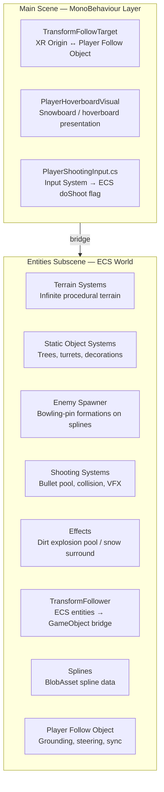
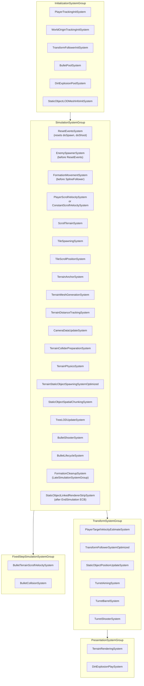

# Escape Mountain — Scene Overview

Top-level architecture guide for the Escape Mountain scene (VR snowboarding / hoverboard).

**Related scene:** [Ace of Ages](../../Ace%20of%20Ages/) is the separate VR flying-shooter rebuild. Both scenes can use the shared DOTS systems under `Assets/_App/Escape Mountain/`.

**Complete document listing:** [Table of Contents](TABLE_OF_CONTENTS.md)

---

## Architecture Summary

Escape Mountain is a Unity 6 VR snowboarding game using a hybrid ECS + MonoBehaviour architecture (evolved from the original Ace of Ages project):

- **ECS (DOTS):** All performance-critical runtime systems live in `Escape Mountain Entities Subscene.unity` and run via Unity.Entities
- **MonoBehaviour:** VR input (`PlayerShootingInput`), hoverboard / player follow (`TransformFollowTarget`, `PlayerHoverboardVisual`), scene entry
- **Bridge:** `TransformFollowerSystem` and `PlayerTrackingInitSystem` connect the MonoBehaviour player rig to ECS entities

---

## System Execution Order

---

## Key Singletons (ECS)

| Singleton | Description | Entity source |
| ----------------------------------- | ----------------------------------------------- | ------------------------------------------ |
| `TerrainTileConfig` | All terrain config parameters | `TerrainConfigAuthoring` |
| `ScrollOffset` | Accumulated terrain scroll offset | `TerrainConfigAuthoring` |
| `TerrainScrollVelocity` | Current scroll direction + speed | `TerrainConfigAuthoring` |
| `PlayerTransformReference` | Managed: player GO Transform | `TerrainConfigAuthoring` |
| `PlayerTargetVelocity` | Smoothed player horizontal velocity | `TerrainConfigAuthoring` |
| `CameraDataSingleton` | Camera position + forward for collider priority | `CameraDataUpdateSystem` (runtime) |
| `StaticObjectSpawnerConfig` | Static object spawn density/filters | `StaticObjectSpawnerConfigAuthoring` |
| `StaticObjectLODConfig` | LOD distances and VR frame-skip config | `StaticObjectSpawnerConfigAuthoring` |
| `PlayerTerrainScrollVelocityConfig` | Player scroll speed/rotation settings | `PlayerScrollVelocityAuthoring` |
| `WorldOriginTransformReference` | Managed: world origin GO Transform | `PlayerScrollVelocityAuthoring` |
| `PrefabEntitiesReferences` | Enemy, bullet, dirt explosion prefab entities | `PrefabEntitiesReferencesAuthoring` |
| `BulletPoolConfig` | Pool size config | `BulletPoolConfigAuthoring` |
| `DirtExplosionConfig` | Pool size + lifetime config | `DirtExplosionPoolConfigAuthoring` |

---

## Scene Entry

Play **`Escape Mountain.unity`** (or `Escape Mountain Start.unity` for the start-scene flow). The Entities Subscene loads the DOTS world (terrain, player follow object, spawners).

For the separate flying-shooter rebuild, see **`Assets/_App/Ace of Ages/Ace of Ages.unity`** (`AceOfAges.cs` triggers a test enemy spawn after 3 seconds).

---

**See also:**

- [Table of Contents](TABLE_OF_CONTENTS.md) — complete document index for all subsystems
- `AGENTS.md` (workspace root) — complete project conventions and architecture guide
- `Terrain/Documentation/README.md` — terrain system documentation hub
